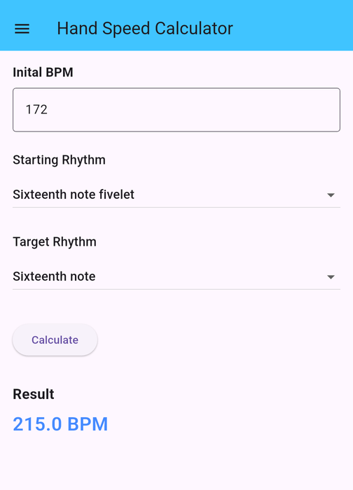
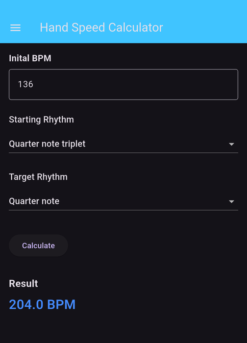

# Hand Speed Calculator

A cross-platform Flutter app for drummers and percussionists that converts a tempo between rhythmic subdivisions while keeping the **same hand speed** (notes per second).

> *I can play sixteenth-note quintuplets at 176 BPM. What metronome setting gives me that same speed with straight sixteenths?*
> **Answer: 220 BPM.**

Musicians often build speed on one subdivision and then want to practice another at the same physical speed. Working that out in your head means doing fraction math with tuplets. This app does the math for you.

<p align="center">
  
  &nbsp;&nbsp;
  
</p>

## Features

- Converts between 15 rhythm types: whole, half, quarter, eighth, sixteenth and thirty-second notes, plus triplets, quintuplets (fivelets), sixlets, sevenlets, ninelets and tenlets
- Rejects invalid input (zero, negative or overflowing BPM) with clear errors
- Light and dark themes, with the choice saved between sessions through `shared_preferences`
- Builds for Android, iOS, Windows, macOS, Linux and the web from one Dart codebase

## How It Works

Each rhythm is stored as its length in quarter-note beats. A sixteenth note is `1/4`, and a sixteenth-note quintuplet is `1/5`. Keeping hand speed constant means:

```
target BPM = starting BPM × (target note length / starting note length)
```

For the example above: `176 × (1/4 ÷ 1/5) = 220 BPM`.

## Tech Stack

| Area | Tools |
| --- | --- |
| Language | Dart (Flutter) |
| UI | Material Design widgets |
| Persistence | `shared_preferences` |
| Testing | `flutter_test` |
| Prototype | Java |

## Project Structure

```
├── flutter/hand_speed_calculator/   # Main Flutter application
│   ├── lib/
│   │   ├── logic/                   # UI-independent calculation code
│   │   │   ├── calculator.dart      # Conversion formula and input validation
│   │   │   └── rhythm_type.dart     # Rhythm enum with note lengths
│   │   ├── pages/                   # App screens
│   │   ├── widgets/                 # Reusable UI parts (BPM input, rhythm picker, result)
│   │   └── main.dart                # App entry point and theme handling
│   └── test/                        # Unit tests for the calculator and rhythm values
└── Hand-Speed-Calculator-Java-Prototype/   # Original Java version of the core logic
```

The calculation logic is kept separate from the UI, so it can be unit tested without building any widgets. The project started as a Java prototype to check the math, and that logic was then ported to Dart for the Flutter app.

## Getting Started

**Prerequisites:** the [Flutter SDK](https://docs.flutter.dev/get-started/install) (Dart 3.10 or later).

```bash
git clone https://github.com/BodeKaanta/Hand-Speed-Calculator.git
cd Hand-Speed-Calculator/flutter/hand_speed_calculator
flutter pub get
flutter run
```

To pick a platform, run `flutter devices` and then `flutter run -d <device>`, for example `flutter run -d windows` or `flutter run -d chrome`.

## Running Tests

```bash
cd flutter/hand_speed_calculator
flutter test
```

The tests check the conversion math against known cases (such as quintuplets at 176 BPM converting to sixteenths at 220 BPM), make sure invalid input raises errors, and confirm the length of each rhythm type.

## Development Process

The project was built in small feature branches, each merged through a pull request (for example, dark mode, saving the theme choice, and UI cleanup).

## Author

**Bode Kaanta** · [GitHub](https://github.com/BodeKaanta)
